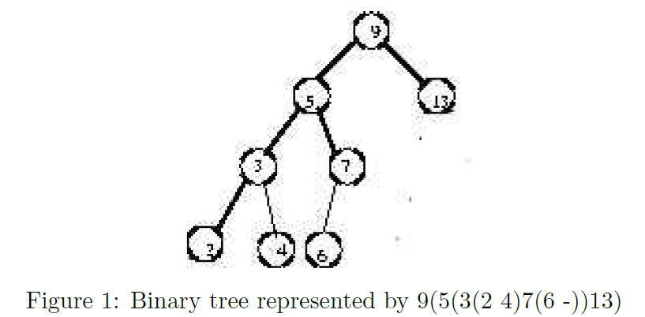

# Data Structures and Programming -- Assignment 1 #

## 1. Introduction ##

A binary tree can be easily represented in the following way. Start with the root. If there are any
children, list them in parentheses. Use - (a dash) for a child that is missing; however do not display a
dash or parentheses for a leaf. For example, the tree in Figure 1 is represented as 9(5(3(2 4)7(6 -))13).

Suppose we want to support textual printing of the values in the trees. In order to accomplish this,
we will logically assign an (x; y) coordinate to each tree node. It is appropriate for the x-coordinate
of the node to be proportional to the in-order traversal number of the node in the tree, and for the
y-coordinate of the node to be proportional to the the depth of the node in the tree. Therefore, we will
need member variables to store these values, and routines to compute the in-order traversal number
and depth of each node in the tree (you may choose what to name these). For example, printing the
binary search tree 12(- 15(- 76(23 99))) yields.

Now consider a binary tree shown in Figure 3, if we look at the tree from the left side, all the nodes
you can see will be the sequence 5 10 20 45, which is called the left boundary of the tree.

## 2. Assignment ##

Given a sequence of keys S, insert elements of S into an initially empty "standard" binary search tree
in the given order. Let the resulting tree be T. Then carry out the following:

- **Output the parenthesis representation of tree T**

- **Print T in the way mentioned above**

- **Output the left boundary of T**

In this assignment, read from an input le "tree.txt" in which each line consists of a sequence of
numbers to be inserted into an initially empty standard binary search tree.

